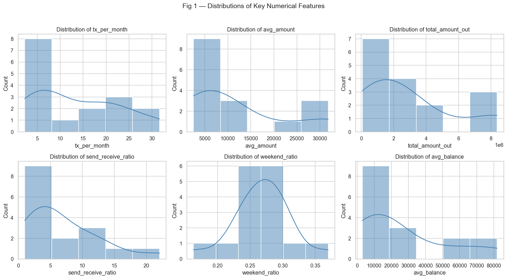
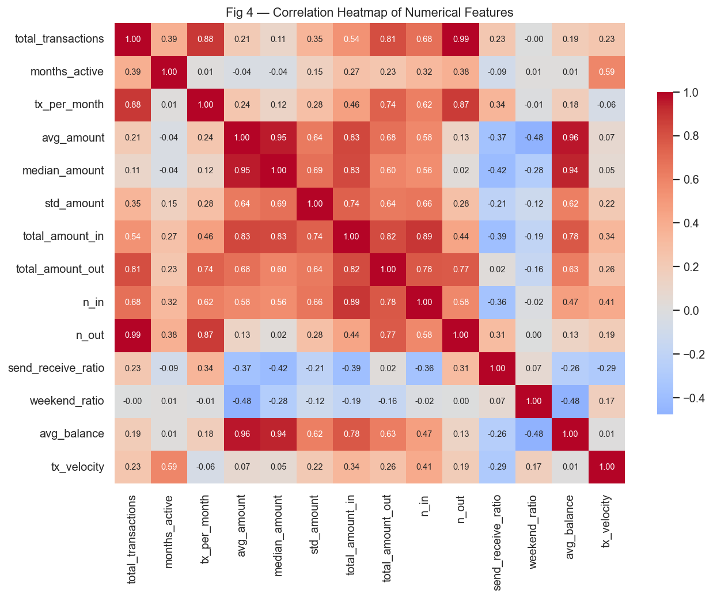
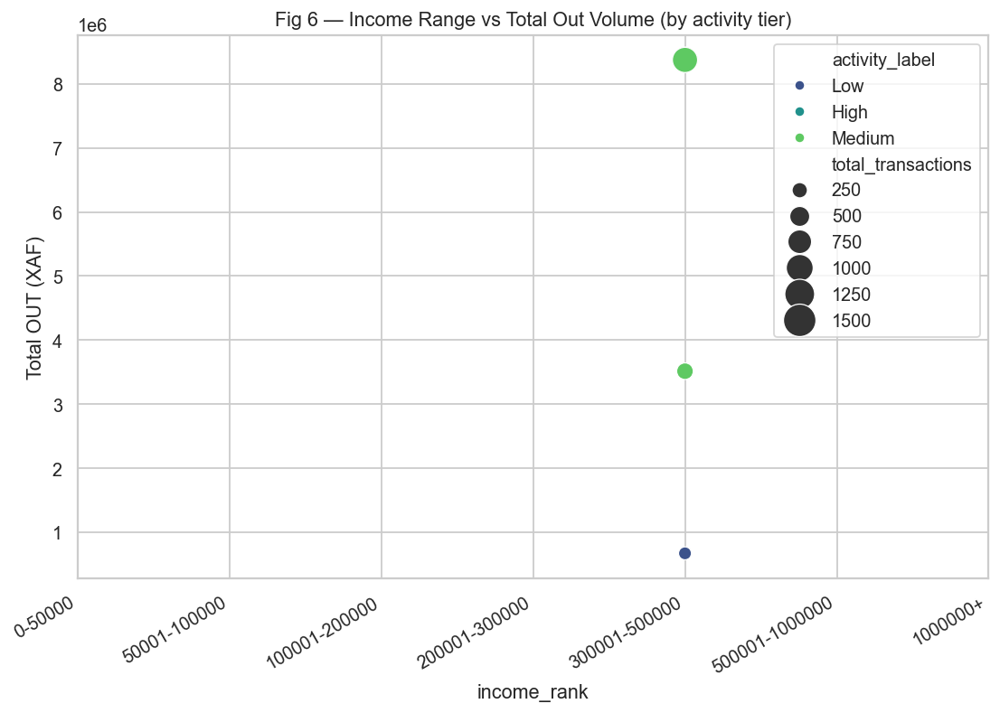

# Complete Data Science Project - Mobile Money Transaction Analysis## Project Overview

This repository holds a comprehensive end-to-end data science pipeline analyzing mobile money transactions. Our goal is to understand consumer behavior and predict the activity tiers (Low, Medium, High) of users based on transaction records. We processed over 7,700 transactions for a volume of ~140M XAF, extracting meaning from data, validating hypotheses, and training multi-class classification models.

## Project Pipeline

### 1. [Data Collection](mobile_money_analysis/Submission/1_Data_Collection)
The foundation of our project is built on securely anonymized datasets representing user transactions. 
- **Files:** [raw_data_anonymized.csv](mobile_money_analysis/Submission/1_Data_Collection/raw_data_anonymized.csv)

### 2. [Data Cleaning](mobile_money_analysis/Submission/2_Data_Cleaning)
In the cleaning step, we rectified missing values, parsed date components, handled duplicates, generated necessary categorical groupings, and prepared behavioral metrics such as send-receive ratios and volume distributions.
- **Workflow:** [data_cleaning.ipynb](mobile_money_analysis/Submission/2_Data_Cleaning/data_cleaning.ipynb) 
- **Generated Clean Data:** [cleaned_data.csv](mobile_money_analysis/Submission/2_Data_Cleaning/cleaned_data.csv)

### 3. [Exploratory Data Analysis (EDA)](mobile_money_analysis/Submission/3_EDA)
Through systematic numerical and visual data exploration, we investigated seasonal variation, volume-level disparities among demographic groups, and pinpointed actionable patterns predicting user financial tiers.

**Key Visualizations:**
*     
    *Highlights the right-skewed distribution of transactions (a few high-activity users drive most of the volume).*
*     
    *Shows relationships confirming that Total Transactions (total_transactions) heavily influences Activity Tiers.*
*     
    *Demonstrates the complex linkage between a user's declared income and outgoing transaction volume.*

**Key Findings:**
- Usage is dominated by "OUT" flow transactions (84.3% spent/sent).
- Highly active periods fall within general business hours (08:00 - 19:00).
- Users can be accurately bucketed into financial activity groups based on behavioral trends (weekend ratio, number of monthly transactions).

- **Execution:** [Exploratory_analysis.ipynb](mobile_money_analysis/Submission/3_EDA/exploratory_analysis.ipynb) or [run_eda.py](mobile_money_analysis/Submission/3_EDA/run_eda.py)
- **Detailed EDA Insights:** [key_insights.md](mobile_money_analysis/Submission/3_EDA/key_insights.md)

### 4. [Modeling](mobile_money_analysis/Submission/4_Modeling)
We transformed our cleaned data into predictive variables to assign an activity-tier label (High, Medium, Low) to a user based on their underlying transaction metrics.

**Model Highlights & Results:**
A variety of models were tested, including Logistic Regression, k-Nearest Neighbors, Decision Trees, Random Forest, and Gradient Boosting.
- **Best Model:** **Gradient Boosting Classifier**
- **Validation Accuracy:** 68.75% (Significantly outperforming the 31.25% baseline)
- **Performance Details:** [model_comparison.csv](mobile_money_analysis/Submission/4_Modeling/results/model_comparison.csv) and [classification_report.txt](mobile_money_analysis/Submission/4_Modeling/results/classification_report.txt)
- **Workflow:** [modeling.ipynb](mobile_money_analysis/Submission/4_Modeling/modeling.ipynb) or [run_modeling.py](mobile_money_analysis/Submission/4_Modeling/run_modeling.py).

## How to run the code

1.  Navigate to the repository root directory.
2.  Install dependencies:
    ```bash
    pip install -r requirements.txt
    ```
    *(Or install manually: pip install pandas numpy matplotlib seaborn scikit-learn jupyter)*
3.  **Data Cleaning:** Run mobile_money_analysis/Submission/2_Data_Cleaning/data_cleaning.ipynb
4.  **EDA:** Run mobile_money_analysis/Submission/3_EDA/run_eda.py or work interactively with mobile_money_analysis/Submission/3_EDA/exploratory_analysis.ipynb
5.  **Modeling:** Run mobile_money_analysis/Submission/4_Modeling/run_modeling.py to regenerate results, or use mobile_money_analysis/Submission/4_Modeling/modeling.ipynb for detailed walkthroughs.

